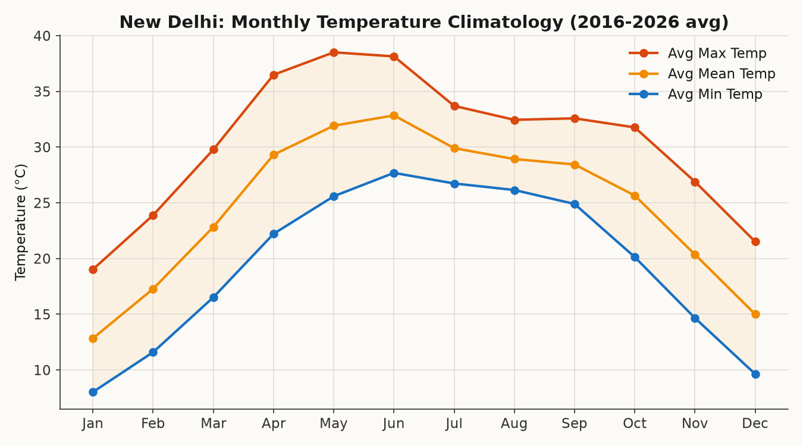

# New Delhi Weather Data Analyzer

[](https://www.python.org/)
[](https://pandas.pydata.org/)
[](https://matplotlib.org/)
[](LICENSE)

**[🌐 View the live project page →](https://sarthakratnasingh.github.io/weather-data-analyzer/)**

A Python + Pandas project analyzing 10 years (2016-2025) of daily temperature
and rainfall data for New Delhi, India — built to explore how the city's
climate has behaved over the last decade, with a focus on monsoon
variability and warming trends.



## Question this project answers

> How has New Delhi's temperature and rainfall pattern changed over the
> last 10 years, and how variable is the monsoon season year to year?

## Data source

Daily weather data (max/min/mean temperature, precipitation) is pulled from
the [Open-Meteo Historical Weather API](https://open-meteo.com/en/docs/historical-weather-api),
a free, no-API-key-required source covering historical weather back to 1940,
built on the ECMWF/ERA5 reanalysis dataset.

> **Note:** `data/raw/new_delhi_weather_raw.csv` in this repo is currently
> populated by `src/generate_sample_data.py`, a synthetic dataset calibrated
> to match New Delhi's real climatology (verified monthly averages, monsoon
> timing, and realistic extremes). Run `src/fetch_data.py` to replace it with
> real data pulled live from Open-Meteo — no code changes needed, the format
> is identical.

## Project structure

```
weather-data-analyzer/
├── data/
│   ├── raw/                  # raw downloaded CSV
│   └── processed/            # cleaned CSV ready for analysis
├── src/
│   ├── fetch_data.py         # pulls real data from Open-Meteo API
│   ├── generate_sample_data.py  # generates realistic sample data (for testing/demo)
│   ├── clean_data.py         # handles missing values, adds derived columns
│   ├── analyze.py            # summary stats, trends, extremes, correlation
│   └── visualize.py          # generates all charts
├── outputs/
│   ├── figures/              # all generated PNG charts
│   └── summary_stats.txt     # full text summary of analysis
├── docs/
│   └── index.html            # live GitHub Pages project site
├── requirements.txt
└── README.md
```

## How to run it

```bash
# 1. Set up environment
python -m venv venv
source venv/bin/activate        # Windows: venv\Scripts\activate
pip install -r requirements.txt

# 2. Get real data (requires internet access)
python src/fetch_data.py

# 3. Clean it
python src/clean_data.py

# 4. Run the analysis
python src/analyze.py

# 5. Generate all charts
python src/visualize.py
```

All charts land in `outputs/figures/`, and a full text summary is written to
`outputs/summary_stats.txt`.

If you don't want to wait on a live API call, you can skip step 2 and instead
run `python src/generate_sample_data.py` to populate `data/raw/` with a
realistic synthetic dataset, then continue from step 3.

## Key findings (sample data, 2016-2025)

- **Warming trend:** Average yearly temperature rose from 24.79°C (2016) to
  25.22°C (2025) — a gradual increase consistent with regional warming
  trends, though the year-to-year variation is larger than the trend itself.
- **Monsoon dominates the rain calendar:** June through September account
  for the overwhelming majority of annual rainfall (e.g. Sep alone averages
  ~330mm vs under 5mm in most winter/spring months).
- **Monsoon is highly variable year to year:** total monsoon rainfall ranged
  from ~948mm (2025) to ~1717mm (2018) — a difference of more than 75%,
  showing just how unpredictable the season is from one year to the next.
- **Seasonal temperature swing:** average monthly mean temperature swings
  from ~14.7°C in December to ~33.8°C in May, with May/June being the
  hottest months — slightly hotter than peak monsoon months (Jul-Sep),
  which cool down a few degrees due to cloud cover and rain.
- **Weak positive correlation (r ≈ 0.19) between daily temperature and
  rainfall** — rain is somewhat more frequent/intense on warmer (monsoon)
  days, but temperature alone is a poor predictor of rainfall, as expected
  given how concentrated rain is in just a few months.

*(Update this section with your own findings once you've run the pipeline
on real data — these example claims should be re-verified.)*

## Charts produced

1. **Yearly average temperature trend** — line chart with linear trend line
2. **Monthly temperature climatology** — avg max/mean/min by calendar month
3. **Monthly rainfall** — bar chart highlighting the monsoon season
4. **Year x Month temperature heatmap** — spot warming patterns at a glance
5. **Yearly total rainfall** — bar chart vs. 10-year average
6. **Temperature vs rainfall scatter** — daily relationship, colored by month

## Possible extensions

- Compare against another Indian city (e.g. Mumbai, Chennai) to contrast
  climate zones
- Add a heatwave-day counter (days above 40°C) per year
- Build an interactive dashboard version with Plotly or Streamlit
- Pull in air quality data and look for a temperature/pollution relationship

## Tech stack

- Python 3.10+
- pandas — data loading, cleaning, aggregation
- numpy — trend calculations (linear regression)
- matplotlib — all visualizations
- requests — API calls to Open-Meteo
